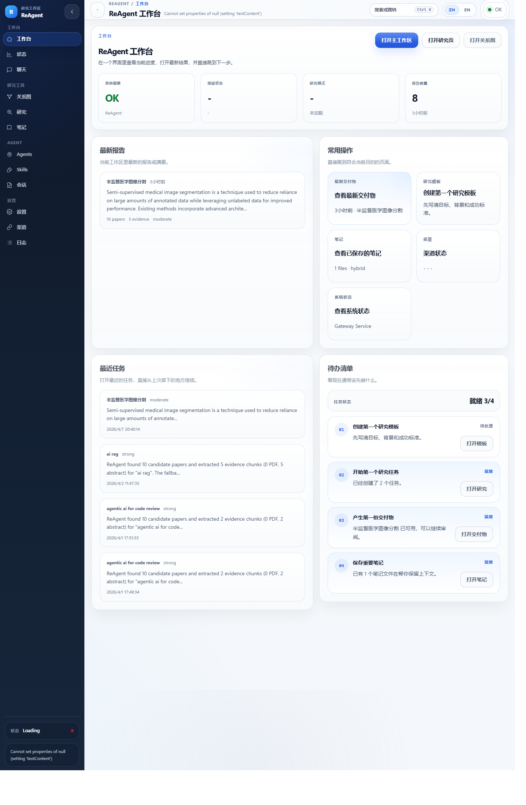

<div align="center">
  
  <h1>🧭 ReAgent</h1>
  <p><strong>把持续科研工作变成可复用流程，而不是一次性对话。</strong></p>
  <p>🧠 面向论文发现、证据整理、研究笔记与结果交付的本地优先研究工作台。</p>
  <p>
    <a href="./README.md">🇺🇸 English</a>
    <span>&nbsp;|&nbsp;</span>
    <a href="./README.zh-CN.md"><strong>🇨🇳 简体中文</strong></a>
  </p>
  <p>
    <a href="./ROADMAP.md">🛣️ 路线图</a>
    <span>&nbsp;•&nbsp;</span>
    <a href="./CONTRIBUTING.md">🤝 贡献指南</a>
    <span>&nbsp;•&nbsp;</span>
    <a href="./OPERATIONS.md">🛠️ 运维说明</a>
  </p>
</div>

<p align="center">
  <a href="https://nodejs.org/">
    
  </a>
  <a href="https://www.typescriptlang.org/">
    
  </a>
  <a href="https://www.prisma.io/">
    
  </a>
  <a href="https://github.com/Sinlair/reagent/actions/workflows/ci.yml">
    
  </a>
  <a href="./LICENSE">
    
  </a>
</p>

<p align="center">
  
</p>

## ⚡ 快速概览

- 🧭 先用研究模板固定目标、背景和成功标准，再开始研究。
- 🔬 在同一个工作区里发起任务、查看证据和阅读输出。
- 🧠 用文件、索引、召回和压缩机制建立可持续维护的知识库。
- 📦 产出报告、幻灯片、模块文件等可复用成果。

## 📌 ReAgent 是什么

ReAgent 不是“外挂了几个研究按钮的聊天机器人”，而是一个本地研究工作台，适合那些需要反复跟进主题、检查证据、保留上下文并输出可复用成果的人。

它主要解决这些问题：

- 🧭 先把研究目标、背景和成功标准固定下来，再开始做研究。
- 🔎 持续跟踪同一个主题，而不是每周从零开始重新搜索。
- 📚 把论文、仓库发现、反馈和笔记放进同一个工作区。
- 🧠 让关键上下文跨任务保留下来，而不是淹没在聊天记录里。
- 🧾 把研究结果沉淀成报告、汇报材料、幻灯片和可复用产物。

## ✨ 项目亮点

| 图标 | 亮点 | 价值 |
| --- | --- | --- |
| 🧭 | 研究模板 | 先保存目标、背景和成功标准，再围绕同一主题重复使用。 |
| 🔬 | 研究工作区 | 在一个页面里发起任务、跟踪进度、阅读报告和管理输出。 |
| 🧠 | 研究笔记 | 把上下文放到文件里保存，不再依赖聊天窗口记忆。 |
| 🗺️ | 研究地图 | 看到主题、证据、报告和文件之间是怎么连接的。 |
| 📦 | 可复用输出 | 生成主题报告、幻灯片、模块文件和其他可分享成果。 |
| 🔌 | 多入口协同 | 同一套工作流可以同时通过 Web、WeChat 和 OpenClaw 插件使用。 |
| ⚙️ | 本地运行可见 | 可直接查看渠道、会话、模型、技能、日志和运行状态。 |

## 🧠 知识库是怎么建立的

ReAgent 的知识库不是“凭空记住”，而是先把内容落到本地文件里，再建立索引和召回层。

- 📝 长期笔记写入 `MEMORY.md`。
- 🗓️ 每日笔记写入 `memory/YYYY-MM-DD.md`。
- 🗂️ 每次保存笔记时，系统都会把标题、摘要、来源、置信度、标签、实体 ID 和时间戳写入 `memory-index.json`。
- 🔎 搜索不是简单字符串匹配。笔记页会直接检索真实文件，召回层还可以把“工作区记忆”与“研究产物”一起合并检索。
- ♻️ 方向报告可以自动回写到记忆里，让高价值摘要在后续任务中继续被召回。
- 🧹 记忆策略保存在 `memory-policy.json`，较早的每日笔记可以按策略压缩成长时段总结。
- 🧾 每次压缩都会记录到 `memory-compactions.json`，所以“哪些笔记被合并、为什么被合并”是可追踪的。

从效果上看，这套知识库由四层组成：

- 📄 原始 Markdown 笔记，方便直接查看和编辑。
- 🗃️ 索引后的元数据，方便快速召回。
- 📚 可参与召回的研究产物，比如研究模板、主题报告和演示材料。
- 🧹 可追踪的压缩历史和策略，避免记忆无限膨胀。

## 🖥️ 主要界面

当前 Web 界面主要由这些工作面组成：

- 🏠 `工作台`：看当前进度、最新结果和常用下一步动作。
- 💬 `主工作区`：聊天、快速发起研究、查看最近任务和当前工作区信息。
- 📈 `状态`：查看近期活动、最新输出和系统健康情况。
- 🔬 `研究工作区`：管理模板、任务列表、报告、定时任务、主题报告、幻灯片和模块文件。
- 🗺️ `研究地图`：查看主题、证据、报告和文件之间的连接关系。
- 🧠 `研究笔记`：搜索、保存和重新打开文件型笔记。
- 🔌 `渠道`：查看 WeChat 登录、连接状态、状态变化和渠道事件。
- 🤖 `智能体设置` 与 `技能`：控制聊天使用的角色、模型和工具访问权限。

## 🚀 快速开始

1. 📄 从 `.env.example` 复制一份本地配置文件。
2. 📦 安装依赖。
3. 🗃️ 把 Prisma schema 推到默认 SQLite 数据库。
4. ▶️ 启动开发服务。

```bash
npm install
npm run db:push
npm run dev
```

🌐 打开 `http://127.0.0.1:3000/`。

🧪 最小本地配置：

```env
LLM_PROVIDER=fallback
WECHAT_PROVIDER=mock
```

🪟 如果 PowerShell 阻止 `npm`，可以直接使用 `npm.cmd`。

🧰 全局 CLI 安装方式：

```bash
npm install -g @sinlair/reagent
reagent init
reagent gateway
```

🏷️ 发布包名是 `@sinlair/reagent`，安装后的命令是 `reagent`。

🔁 常驻 gateway 相关命令：

```bash
reagent gateway install
reagent gateway status
reagent gateway restart
reagent gateway stop
```

## 🔄 运行模式

根应用既可以作为前台开发进程运行，也可以作为后台常驻服务运行。

| 图标 | 模式 | 命令 | 说明 |
| --- | --- | --- | --- |
| 🧪 | 开发模式 | `npm run dev` | 本地开发与实时刷新 |
| ♾️ | PM2 | `npm run pm2:start` / `npm run pm2:restart` / `npm run pm2:logs` | 适合后台持续运行 |
| 🪟 | Windows 服务 | `npm run service:install` / `npm run service:status` / `npm run service:start` / `npm run service:stop` | 适合 Windows 机器级常驻 |

更多部署和维护说明见 [OPERATIONS.md](./OPERATIONS.md)。

## 🗂️ 仓库结构

| 图标 | 路径 | 作用 |
| --- | --- | --- |
| 🧩 | `./` | ReAgent 根应用、Web 界面、API 服务和运行时 |
| 🧠 | [`packages/reagent-core/`](./packages/reagent-core) | 可复用的核心研究逻辑 |
| 🔌 | [`packages/reagent-openclaw/`](./packages/reagent-openclaw) | 可安装的 OpenClaw 插件包 |
| 🧪 | [`package/`](./package) | 仓库内的 OpenClaw WeChat 参考包，用于兼容和集成 |
| 🖼️ | [`docs/`](./docs) | 产品截图和相关说明文档 |

## ✅ 开发校验

建议执行：

```bash
npm run check:all
npm run test
```

如果你只想校验可发布的包：

```bash
npm run build:packages
npm run check:packages
```

## 🔌 OpenClaw 插件

安装 ReAgent 的 OpenClaw 插件：

```bash
openclaw plugins install @sinlair/reagent-openclaw --yes
```

插件源码位于 [packages/reagent-openclaw/](./packages/reagent-openclaw)。

## 📚 相关文档

- 📘 English README: [README.md](./README.md)
- 🧭 产品蓝图: [agent.md](./agent.md)
- 🛣️ 路线图: [ROADMAP.md](./ROADMAP.md)
- 🛠️ 运维说明: [OPERATIONS.md](./OPERATIONS.md)
- 🤝 贡献指南: [CONTRIBUTING.md](./CONTRIBUTING.md)
- 🔒 安全说明: [SECURITY.md](./SECURITY.md)

## 🙌 参考项目

ReAgent 的产品形态参考了这些研究代理和研究工作区项目：

- 🧪 [GPT Researcher](https://github.com/assafelovic/gpt-researcher)
- 🌊 [deer-flow](https://github.com/bytedance/deer-flow)
- 🧭 [PASA](https://github.com/bytedance/pasa)
- 📄 [Paper2Agent](https://github.com/jmiao24/Paper2Agent)
- 🏢 [enterprise-deep-research](https://github.com/SalesforceAIResearch/enterprise-deep-research)
- 🤖 [InternAgent](https://github.com/InternScience/InternAgent)
- 🔓 [OpenClaw](https://github.com/openclaw/openclaw)

更具体的对比见 [docs/research-agent-landscape.md](./docs/research-agent-landscape.md)。

## 📄 许可证

项目采用 [MIT License](./LICENSE)。
