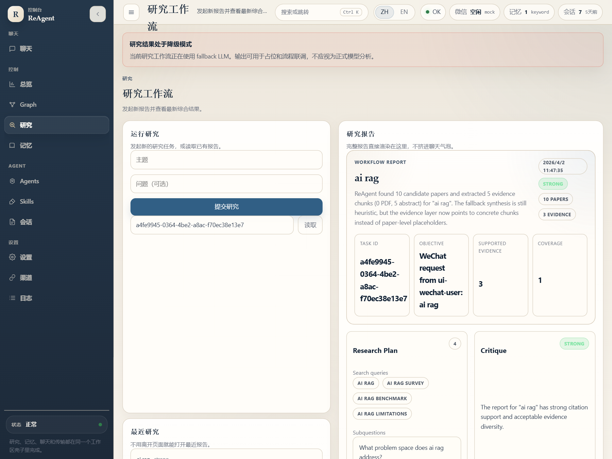

# Public Walkthroughs

This page collects short public walkthroughs that demonstrate ReAgent's product value.

## 1. Personal Researcher Walkthrough

Goal:

- install ReAgent
- start the runtime
- create the first scoped research run

Commands:

```powershell
npm install -g @sinlair/reagent
reagent onboard
reagent onboard --apply
reagent home
reagent service run
reagent research enqueue "browser agents" --question "Which open-source baselines are strongest?"
reagent research tasks
reagent research report <taskId>
```

Relevant screenshot:

- 

## 2. OpenClaw And Channel Runtime Inspection Walkthrough

Goal:

- inspect host-facing sessions
- inspect runtime-facing sessions
- understand how the bridge and canonical runtime surfaces relate

Commands:

```powershell
reagent openclaw status
reagent openclaw sessions
reagent openclaw history <sessionKey>
reagent channels status
reagent sessions
reagent history <sessionKey>
reagent agent sessions
reagent agent session <sessionId>
reagent agent host sessions
reagent status --all
```

Relevant screenshot:

- 

## 3. Brief To Report To Artifact Reopen Walkthrough

Goal:

- create or reuse a brief
- generate a report
- reopen saved artifacts from the workspace

Commands:

```powershell
reagent research directions
reagent research enqueue "agentic rag" --question "What reusable retrieval modules appear across recent work?"
reagent research report <taskId>
reagent research handoff <taskId>
reagent research workstream <taskId> search
reagent research bundle <taskId>
```

In the Web console, the same path should surface:

- recent reports
- recent artifacts
- workstream memo reopen

Relevant screenshot:

- 
